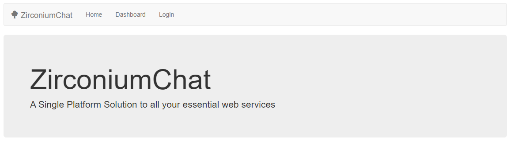
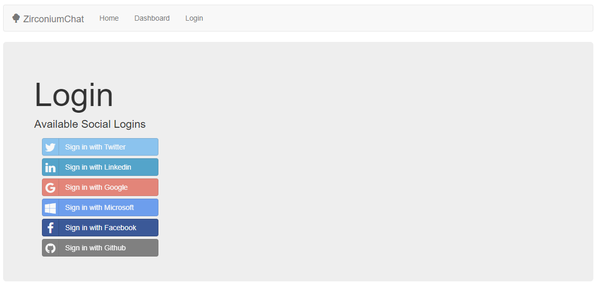
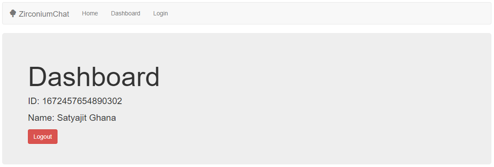

# NodeJS Express Passport Oauth Template

## How to setup this repo

Read how to setup Facebook-Passport-OAuth : http://www.passportjs.org/docs/facebook/

Replace the CLIENT_ID and CLIENT_SECRET in `.env`

Use this repo as a template for creating Social OAuths using Passport.js and Express

## Run the server

```bash
$ npx nodemon
```

---

## Screenshots







